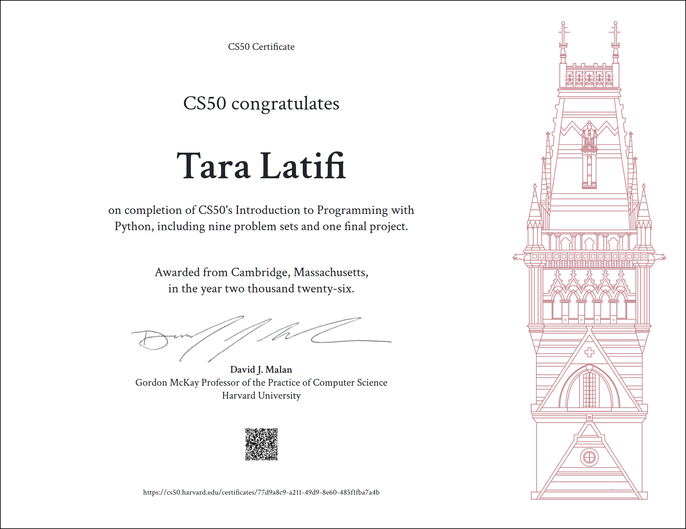

# 🏋️ CLI Task & Workout Tracker

An interactive, Python-based command-line interface application designed to help users efficiently log, validate, and track daily physical workouts or study sessions with structured persistence and formatted data visualizer. Built as the Capstone Final Project for **CS50P: CS50's Introduction to Programming with Python** at **Harvard University**.

---

## 📌 Features & Core Functionality

- **Interactive Menu Interface:** Prompts users for activity logs with continuous session support and error handling.
- **Strict Input Validation:** Enforces strict `YYYY-MM-DD` date structures using Python's `datetime` module and guarantees that duration values are positive integers.
- **Data Normalization:** Automatically trims trailing whitespace, normalizes activity titles to Title Case, and supplies fallback titles for empty inputs.
- **CSV Data Persistence:** Safely appends structured records into a `tracker.csv` storage file without corrupting existing logs.
- **Formatted Summary Display:** Integrates the `tabulate` library to render saved records into clean ASCII visual grid formats inside the terminal.

---

## 🎥 Video Demo & Walkthrough

Watch the comprehensive video demonstration walking through application flow and automated unit test executions:  
👉 **[Watch CLI Task & Workout Tracker Demo on YouTube](https://www.youtube.com/watch?v=cykifq5mA5I)**

---

## 🏗️ System Architecture & File Structure

The repository is structured to maintain clean modular separation between CLI entry logic, data transformation pipelines, and unit test suites:

- **`project.py`**: The primary executable module containing core logic.
- **`test_project.py`**: Automated unit test suite built with `pytest` to test core logic independently of input streams.
- **`requirements.txt`**: Declares external package dependencies (`pytest` and `tabulate`).
- **`tracker.csv`**: Automated CSV database file created at runtime for data storage.

---

## 💡 Engineering & Design Choices

- **CSV Persistence vs. Relational Database:** A lightweight CSV file was intentionally chosen over a relational database like SQLite to preserve zero-configuration portability for command-line environments.
- **Decoupled Business Logic for Testing:** Data validation and formatting functions are kept strictly independent of `input()` / `print()` statements to allow 100% deterministic unit testing using `pytest`.

---

## 🛠️ Installation & Usage Guide

### Prerequisites
- Python 3.9+
- `pip` package manager

### 1. Clone the Repository
`git clone [https://github.com/T2004-la/cli-task-workout-tracker.git](https://github.com/T2004-la/cli-task-workout-tracker.git)`  
`cd cli-task-workout-tracker`

### 2. Install Dependencies
`pip install -r requirements.txt`

### 3. Run the CLI Application
`python project.py`

### 4. Run Automated Unit Tests
`pytest test_project.py`

---

## 🎓 Verified Certificate & Final Project

Developed by **Tara Latifi** as the capstone final project for **CS50P: CS50's Introduction to Programming with Python** (Harvard University).

  

